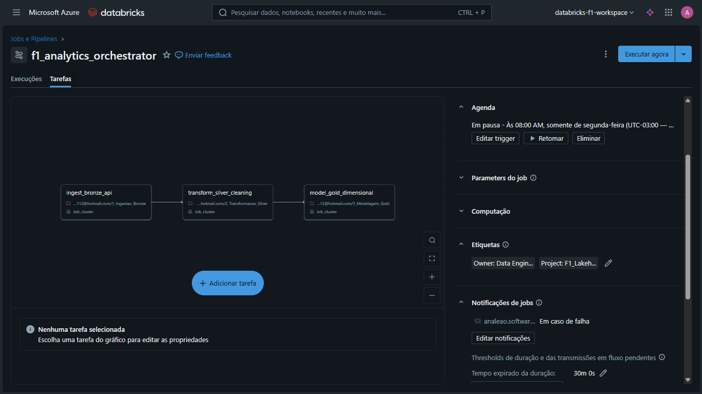
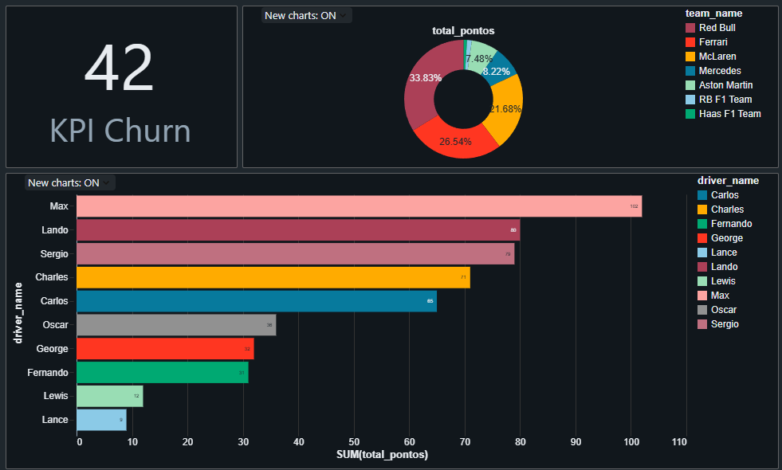

# 🏎️ F1 Data Lakehouse | End-to-End Data Engineering Project


## 💼 Sobre o Projeto (Business Value)

Este projeto não é apenas uma análise de Fórmula 1. É uma simulação completa de um **Data Lakehouse Corporativo**, desenhado para resolver problemas de escalabilidade, qualidade de dados e Business Intelligence.

O objetivo foi construir um pipeline resiliente que ingere dados brutos, trata e modela para Analytics, aplicando as mesmas técnicas usadas em grandes empresas de Varejo e SaaS (como **Petlove**, **iFood** ou **Nubank**).

### 🎯 Visão de Produto: Do Esporte ao Negócio

Para demonstrar aplicabilidade comercial, mapeei métricas técnicas da F1 para KPIs de negócios reais:

| Conceito F1               | Equivalente Corporativo (SaaS/Varejo) | Problema de Negócio Resolvido                                           |
| :------------------------ | :------------------------------------ | :---------------------------------------------------------------------- |
| **Resultados de Corrida** | **Fato Vendas / Transações**          | Monitoramento de receita e volume de vendas.                            |
| **Pilotos & Equipes**     | **Clientes & Marcas**                 | Análise de LTV (Lifetime Value) e Market Share.                         |
| **Abandonos (DNF)**       | **Churn (Cancelamento)**              | Identificação de taxa de perda de clientes e confiabilidade do produto. |
| **Volta Mais Rápida**     | **Pico de Uso/Acesso**                | Análise de performance e engajamento máximo.                            |

---

## 🏗️ Arquitetura da Solução

O projeto segue a **Medallion Architecture** (Bronze, Silver, Gold), garantindo a qualidade do dado em cada estágio.

### 1. Ingestão (Camada Bronze) 🥉

- **Fonte:** API Externa (Jolpica/Ergast F1).
- **Processo:** Coleta de dados brutos em formato JSON.
- **Tech:** Python (`requests`) e PySpark.

### 2. Transformação (Camada Silver) 🥈

- **Limpeza:** Tratamento de nulos, tipagem forte (Schema Enforcement) e normalização de datas.
- **Deduplicação:** Remoção de registros duplicados para garantir integridade.
- **Performance:** Uso do formato **Delta Lake** e **Particionamento** (`partitionBy('season')`) para otimizar leituras em Big Data.

### 3. Modelagem de Negócios (Camada Gold) 🥇

- **Modelagem:** Criação de um **Star Schema** (Modelo Dimensional).
- **Dimensões:** `dim_drivers`, `dim_constructors`, `dim_races`.
- **Fato:** `fact_results` (contendo apenas chaves e métricas).
- **Objetivo:** Facilitar a conexão com ferramentas de BI (Power BI, Tableau, Databricks SQL).

---

## ⚙️ Orquestração e Pipeline (CI/CD)

O pipeline é totalmente automatizado via **Databricks Workflows**, simulando um ambiente de produção com dependências e monitoramento.


_(Fluxo de execução: Ingestão -> Transformação -> Modelagem)_

- **Job Name:** `f1_analytics_orchestrator`
- **Features:** Retries automáticos em caso de falha de API, parâmetros dinâmicos (ano/temporada) e alertas de erro.

---

## 📊 Analytics e Resultados

Como prova de valor (Proof of Value), foi desenvolvido um Dashboard no Databricks SQL para monitorar os KPIs em tempo real.



**Insights Gerados:**

1.  **Dominância de Mercado:** Análise de pontos por equipe (Market Share).
2.  **Performance Individual:** Ranking de pilotos por temporada.
3.  **KPI de Confiabilidade:** Cálculo da taxa de "Churn" (Abandonos de corrida), essencial para medir a saúde técnica das equipes.

---

## 🛠️ Stack Tecnológica

- **Cloud Provider:** Microsoft Azure (Data Lake Gen2).
- **Processamento Distribuído:** Apache Spark (Databricks).
- **Storage & Formato:** Delta Lake (ACID Transactions).
- **Linguagem:** Python (PySpark) para ETL e SQL para Análises.
- **Orquestração:** Databricks Jobs.

---

## 🚀 Como Executar

1.  **Clone o repositório:**
    ```bash
    git clone [https://github.com/ana-lapas/f1-lakehouse.git](https://github.com/ana-lapas/f1-lakehouse.git)
    ```
2.  **Setup no Databricks:**
    - Importe os notebooks da pasta `/notebooks`.
    - Configure as credenciais do Azure no notebook `1_Ingestao_Bronze`.
3.  **Execute o Pipeline:**
    - Crie um Job apontando para os 3 notebooks sequencialmente.
    - Execute o Job e verifique os dados no Data Lake.

---

## 📫 Autor

Desenvolvido por **[Seu Nome]**

- [LinkedIn](https://www.linkedin.com/in/ana-paula-leao/)
- [Portfólio](https://github.com/ana-lapas)

---

_Projeto desenvolvido com foco em boas práticas de Engenharia de Dados para cenários de alta escala._

